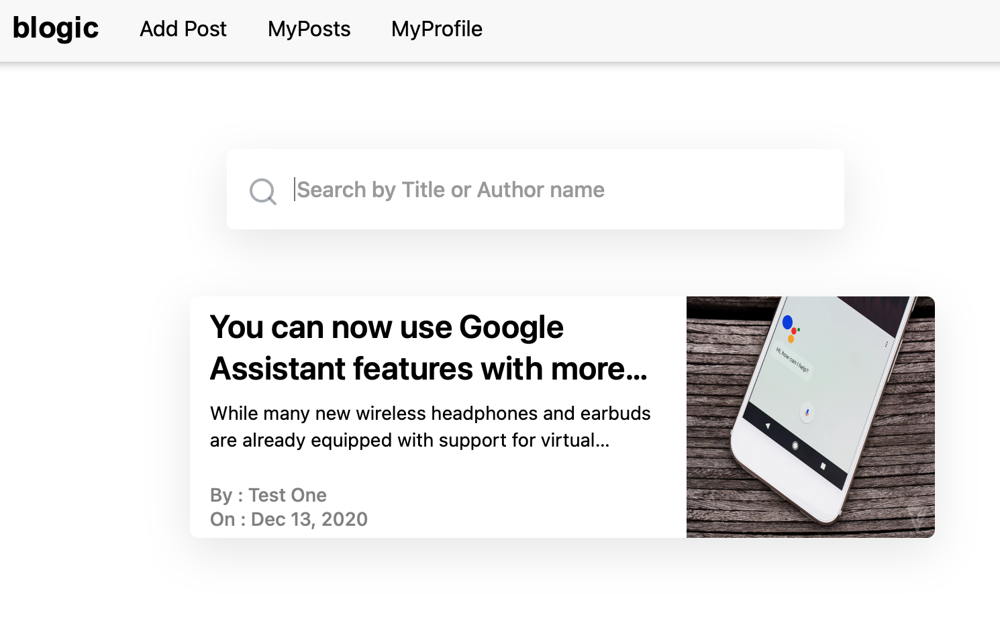

# Blogic

<b>Blogic</b> is a community-driven blog application.   
Contributing is as easy as signing up.

## Technological Stack

- Angular
- Firebase
- Sass

## Getting started

A live version is available at https://blogic-a7c0b.web.app
 
Additionally, a production build is available in the 'dist' directory.

## Supported functionalities

- <b>Guest</b> users are capable of viewing the most recently added blogposts. An account is necessary for further interaction.
- <b>Logged in</b> users can view all posts as well as add and modify their own. They can react and leave comments to other users' content.

## Routes

- <b>Accessible by guest users:</b>
- /home
- /login
- /register
   
- <b>Accessible by registered users:</b>
- /home
- /add
- /view/:id
- /edit/:id
- /profile
